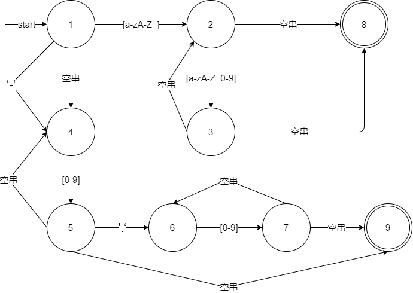
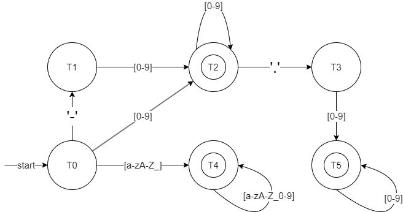
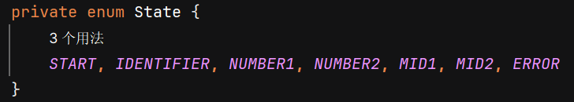
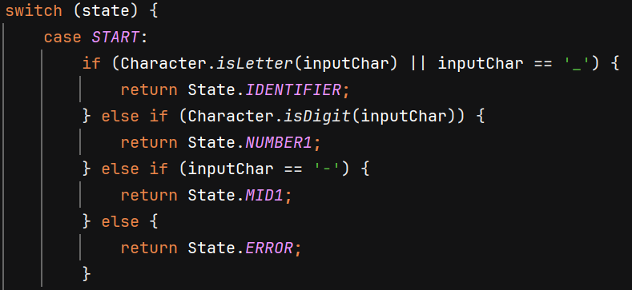
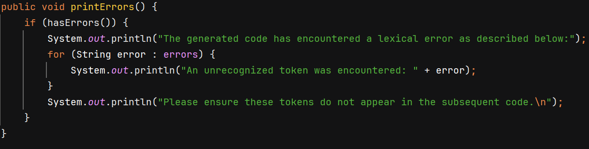

# **中山大学计算机学院本科生实验报告**

课程名称：编译原理

| 实验  | **自选项目Lab1**              | 专业（方向） | 系统结构  |
| ----- | ----------------------------- | ------------ | --------- |
| 学号  | **21307117**                  | 姓名         | 聂湛尚    |
| Email | **niezhsh@mail2.sysu.edu.cn** | 完成日期     | 2024/3/27 |

## 介绍

这是自选项目的第一份实验报告，我基于[RCLLang](https://github.com/LLM-Language-Robot/RCLLang)的词法，实现了词法分析器，并能够生成合适的词法错误信息反馈给大语言模型。

## 实验过程和核心代码

### 结构描述

我设计了4个类：

1. Lexer 类用于从输入文本中读取内容，并将其分割成一系列的Token，分别匹配各个token。
2. GrammarRule类用于从语法文本读取语法，最后包含多个语法规则的类，每个规则由一个Token名称和一个匹配模式组成。
3. MatchIdentifierOrNumber 类使用有限状态自动机（DFA）来判断字符串是否为合法的标识符或数字
4. Scan类是文件扫描类，用于读取文本文件内容。

### GrammarRule类的实现

GrammarRule类会根据语法文件读取各个语法规则，可以在语法文件中定义关键字和特殊符号

但是标识符和数字按如下正则规则识别，暂时未实现自定义正则表达式
ID          : [a-zA-Z_][a-zA-Z_0-9]*;
NUMBER      : '-'?[0-9]+ ('.' [0-9]+)?;

### Lexer 类实现

Lexer 类会先对输入文件进行处理，因为词法规则比较简单，我直接根据空格来将每行输入分词，然后逐词匹配。优先匹配在语法文件中已经定义好的关键字和特殊符号，然后再匹配标识符和数字。

### 标识符和数字的匹配

根据标识符和数字的正则表达式画出如下的NFA（省略了部分空串转移）

然后写出用于构建dfa的状态转移表

|    状态     |  [a-zA-Z_]  |    [0-9]    |   ’-‘   |   ’.‘   |
| :---------: | :---------: | :---------: | :-----: | :-----: |
|  （1,4）T0  |  （2,8）T1  | （4,5,9）T2 | （4）T3 |         |
|  （2,8）T1  | （2,3,8）T4 | （2,3,8）T4 |         |         |
| （4,5,9）T2 |             | （4,5,9）T2 |         | （6）T5 |
|   （4）T3   |             | （4,5,9）T2 |         |         |
| （2,3,8）T4 | （2,3,8）T4 | （2,3,8）T4 |         |         |
|   （6）T5   |             | （6,7,9）T6 |         |         |
| （6,7,9）T6 |             | （6,7,9）T6 |         |         |

然后进行最小化dfa:

划分为非接受状态集NS:	{T0,T3,T5}

接受状态集AS:	{T1,T2,T4,T6}

先分割非接受状态集NS：

|   状态    | [a-zA-Z_] | [0-9] | ’-‘  | ’.‘  |
| :-------: | :-------: | :---: | :--: | :--: |
| （1,4）T0 |    AS     |  AS   |  NS  |      |
|  （4）T3  |           |  AS   |      |      |
|  （6）T5  |           |  AS   |      |      |

因为T0经过’-‘指向NS，必须分割出来：

NS1:	{T0}

NS2:	{T3,T5}

{T3,T5}的指向相同，暂时不用分割

再分割接受状态集AS：

|    状态     | [a-zA-Z_] | [0-9] | ’-‘  | ’.‘  |
| :---------: | :-------: | :---: | :--: | :--: |
|  （2,8）T1  |    AS     |  AS   |      |      |
| （4,5,9）T2 |           |  AS   |      | NS2  |
| （2,3,8）T4 |    AS     |  AS   |      |      |
| （6,7,9）T6 |           |  AS   |      |      |

因为T2经过’.‘指向NS2，必须分割出来：

AS1：	{T2}

AS2：	{T1,T4,T6}

但是因为8和9状态表示两种不同必须分开接收，所以T6也必须分割出来

AS1：	{T2}

AS2：	{T1,T4}

AS3：	{T6}

因为T2和T6分割开了，那么{T3,T5}指向不同，又不能合并，再次分割：

NS1:	{T0}

NS2:	{T3}

NS3:	{T5}

此时已经无法继续分割，所以最后合并结果如下：

AS1：	{T2}

AS2：	{T1,T4}

AS3：	{T6}

NS1:	{T0}

NS2:	{T3}

NS3:	{T5}

此时状态转移表为：

|   状态    | [a-zA-Z_] |  [0-9]  | ’-‘  | ’.‘  |
| :-------: | :-------: | :-----: | :--: | :--: |
|    T0     |  {T1,T4}  |   T2    |  T3  |      |
|    T3     |           |   T2    |      |      |
|    T5     |           |   T6    |      |      |
|   T2 A    |           |   T2    |      |  T5  |
| {T1,T4} A |  {T1,T4}  | {T1,T4} |      |      |
|   T6 A    |           |   T6    |      |      |

最后修改一下状态名转化为dfa图

核心代码实现：对应地定义了6个状态

然后根据dfa编写对应的代码，以开始状态为例：

### 错误信息反馈

Lexer类还包含一个错误信息列表，可以根据词法分析中发现的错误，反馈出现的错误和对应的位置

因为错误信息需要反馈给大语言模型，我增加了一些提示性的话语明确地**描述期望的行为**提醒语言模型不应出现这些不匹配的词。

## 实验结果

